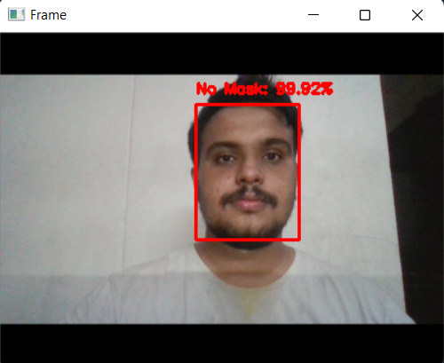
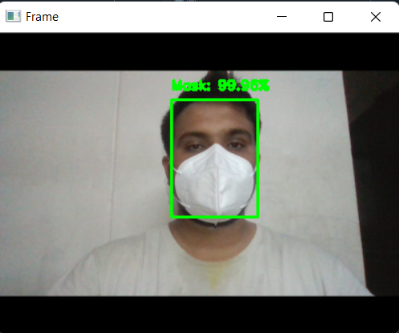

# Face Mask Detection using ML

Face Mask Detection Mini Project.

## Introduction

COVID-19 and other viral mainly spreads through droplets present in air. Because of this, the virus spreads rapidly among the masses. With the nationwide lock downs being lifted, it has become even harder to track and control the virus. Face masks are an effective method to control the spread of virus. It had been found that wearing face masks is 96% effective to stop the spread of virus. The governments, all over the world, have imposed strict rules the everyone should wear masks while they go out. But still, some people may not wear masks and it is hard to check weather everyone is wearing mask or not. In such cases, computer vision will be of great help.

This project increases the demand for an efficient system for detecting face masks on
people for transportation means, densely populated areas, residential districts, large-scale
manufacturers and other enterprises to ensure safety. This project uses machine learning
classification using OpenCV and Tensorflow to detect face masks on people.

## Evaluation of Model

The model trains on 20 Epochs on 32 batch sizes using Adam optimizer with learning rate 0.0001. Using 3,064 training images and 766 testing images, the model achieves more than 95% accuracy with minimum training loss.

The plot given below evidently shows the training accuracy and loss of the model.

## Result

This is a model developed for face mask detection based on deep learning,implemented using open-source python libraries. Here the model can detect people whether they’re wearing mask or not from the real time video as shown in figure . The result shown will be ”Mask” or ”No Mask” depending on whether the person is wearing mask or not while video streaming. 

### No Mask

### With Mask

